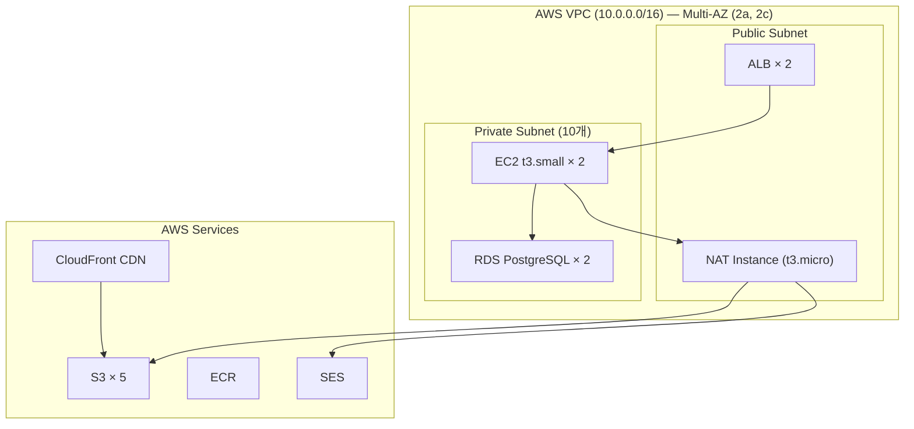
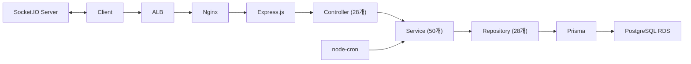
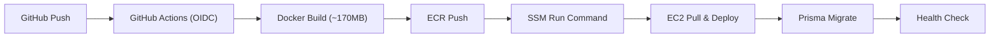

# 인톡 케어 개인 개발 리포트 - 임정빈

> 보험 설계사-고객 매칭 B2B SaaS 플랫폼

**역할** PO · 제품 리드 · 1인 풀스택 (4인 팀 → 단독 개발/운영)
**기간** 2025.10 ~ 2026.03 (6개월)

| 수치               | 항목                         |
| ------------------ | ---------------------------- |
| **600+** 커밋      | FE 340 + BE 260              |
| **87회** 자동 배포 | GitHub Actions CI/CD         |
| **120+** 기능      | 프론트/백엔드/인프라 전 영역 |
| **480ms → 20ms**   | 인증 미들웨어 95% 성능 개선  |
| **Lighthouse 89**  | 접근성 92 · SEO 100 · LCP 0.5s |
| **100%** 가동률    | 5XX 에러율 0.04%             |

<details>
<summary>랜딩 페이지 (데스크톱 + 모바일)</summary>

| 데스크톱 | 모바일 |
| :------: | :----: |
|  |  |

</details>

---

## Problem & My Role

### 프로젝트 배경

보험 설계사와 고객을 매칭하는 B2B SaaS 플랫폼입니다. 초기 4인 MVP 팀(풀스택 2, 디자인 1, PM 1)에서 제품팀 리드를 맡아 MVP 구현을 주도했습니다. 시니어 개발자는 부재했습니다.

### 팀 변화와 역할 확장

MVP 완성 후 회사 조직 구조 조정으로 개발 인원이 축소되었고, 최종적으로 제품당 개발자 1명 체제가 되어 인톡 케어를 단독으로 개발·운영하게 되었습니다.

이후 **기획 → 디자인 → 프론트엔드 → 백엔드 → 인프라 → 고객 응대**까지 전 영역을 담당했습니다.

### 우선순위 결정 방식

직접 고객 응대를 병행하면서 **사용자가 불편을 느끼는 지점을 1순위로 파악하고 즉시 해결**, 이후 추가 기능을 구현하는 방식으로 우선순위를 정했습니다.

### 핵심 의사결정

**1. Lambda → EC2 전환** — 실시간 채팅 요구사항 등장 시 Lambda의 콜드 스타트(3~5초)와 WebSocket 미지원이 근본적 한계라 판단, 3일 내 EC2 + Docker 기반 VPC로 완전 마이그레이션.

**2. 간편결제 도입** — 수동 계좌이체로 입금 확인까지 고객이 대기하는 구조가 신뢰성을 떨어뜨림. 카카오페이 간편결제 + 자동 충전 + 자동 구독을 도입하여 결제~서비스 제공 대기 시간을 제거하고 운영 부담을 대폭 감소.

**3. 자체 Analytics 구축** — GA4는 커스텀 퍼널 분석에 한계가 있고 데이터 소유권이 외부에 종속됨. 자체 Analytics 시스템을 구축하여 가입 전환율·이탈 원인·UTM 소스를 직접 추적.

**4. DB 의존 인증 → JWT 페이로드 전환** — 모든 API 요청마다 DB 토큰 조회로 응답 480ms까지 급증. 쿼리 최적화가 아닌 인증 구조 자체를 변경해야 한다고 판단, JWT 페이로드 기반 검증으로 전환하여 DB 조회를 완전 제거.

---

## 시스템 아키텍처

### 인프라 구성 (AWS ap-northeast-2)



### 백엔드 레이어



### CI/CD 파이프라인



---

## Case Study 1 — Lambda → EC2 인프라 마이그레이션

### 문제

초기에 비용 최적화를 위해 **Lambda**로 인프라를 구성했습니다. 그러나 12월, 실시간 채팅 기능 구현 단계에서 근본적인 한계를 발견했습니다.

- **콜드 스타트**로 초기 응답이 3~5초씩 걸림
- **WebSocket을 지원하지 않아** 실시간 통신 자체가 불가능

### 시도

Lambda 환경 내에서 API Gateway WebSocket 등의 대안을 검토했으나, Lambda 아키텍처가 상시 연결형 서비스에 근본적으로 부적합하다고 판단했습니다.

### 해결

**3일 내 EC2 + Docker 기반 VPC 아키텍처로 완전 마이그레이션**했습니다.

- Private Subnet 기반 보안 아키텍처 재설계
- NAT Instance를 통한 외부 API 통신 구성
- Nginx 리버스 프록시 설정
- Docker Multi-stage 빌드로 이미지 ~170MB 최적화
- OIDC 기반 AWS 인증으로 시크릿 키 없는 CI/CD 구현

### 결과

- 콜드 스타트 제거 → 응답 지연 해소
- Socket.IO 기반 실시간 채팅 구현 가능
- 이후 **100% 서비스 가동률** 달성

<!-- 이미지: Before(Lambda) / After(EC2) 아키텍처 비교도 -->
<!-- 이미지: GitHub Actions 배포 성공 화면 -->

---

## Case Study 2 — 인증 미들웨어 95% 성능 개선

### 문제

초기 설계에서 **모든 API 요청마다 DB에서 토큰을 조회**하는 구조로 만들었습니다. 서비스가 커지면서 응답 시간이 **480ms까지 급증**하여 사용자 체감 성능이 크게 저하되었습니다.

### 시도

DB 쿼리 최적화만으로는 근본적 해결이 불가능했습니다. 인증 로직 자체의 구조 변경이 필요하다고 판단했습니다.

### 해결

**JWT 페이로드 기반 검증으로 전환**하여 DB 조회를 완전히 제거했습니다.

- JWT 이중 토큰 구조 (Access 15분 + Refresh 7일)
- LRU 캐시 도입으로 암호화 키 파생 최적화

### 추가 문제 — 동시 401 토큰 경합

SPA 환경에서 여러 API가 동시에 401 응답을 받으면 **refresh 요청이 N번 중복 발생**하는 문제가 있었습니다.

진행 중인 refresh Promise를 변수에 저장하고, 이후 요청은 같은 Promise를 await하는 **Singleton 패턴**으로 해결했습니다.

```typescript
// 토큰 갱신 Singleton 패턴 (핵심 로직)
let refreshPromise: Promise<string> | null = null;

async function getValidToken(): Promise<string> {
  if (refreshPromise) return refreshPromise; // 이미 갱신 중이면 같은 Promise 대기

  refreshPromise = refreshToken().finally(() => {
    refreshPromise = null;
  }); // 완료 후 초기화

  return refreshPromise;
}
```

### 결과

| 지표           | Before   | After                        |
| -------------- | -------- | ---------------------------- |
| API 응답 시간  | 480ms    | **20ms** (95% 개선)          |
| 토큰 갱신 요청 | N번 중복 | **1번** (Singleton)          |
| 5XX 에러율     | —        | **0.04%** (33만 건 중 146건) |

---

## Case Study 3 — 매칭 UX 리디자인 & 모바일 퍼스트 성능 최적화

### 문제

- 데스크톱 전용 **테이블 목록** UI → 전환율 10%에 머묾
- 초기 로딩 **3.67초**, 모바일 이용 불가 상태
- 모바일 방문자 약 **50명/일** 수준

### 해결 — 프론트엔드

적합도 점수(0~100)를 시각화한 **카드형 UI**로 전면 리디자인했습니다.

- **6개 다차원 필터**: 시군구 · 활동시간 · 경력 · 등급 · 관심분야 · 전업/부업
- 필터 조합별 페이지 리셋, 검색 디바운싱, Skeleton 로딩
- 모바일 전용 필터 · 드로어 · 헤더 구축
- **27개 페이지 모바일 퍼스트 반응형** 전환

### 해결 — 성능

- **TanStack Query 캐싱** (staleTime 1분, gcTime 5분) → 불필요한 네트워크 요청 제거
- **RSC 중심 설계**로 클라이언트 번들 최소화
- 서버 컴포넌트에서 초기 데이터 프리페치 → 순차 로딩 제거

### 결과

| 지표            | Before  | After              |
| --------------- | ------- | ------------------ |
| Lighthouse 성능 | —       | **89점**           |
| LCP             | 3.67s   | **0.5s**           |
| FCP             | —       | **0.4s**           |
| 모바일 방문자   | 50명/일 | **100명/일** (2배) |
| 반응형 페이지   | 0       | **27개** 전체      |


---

## Case Study 4 — 실시간 채팅 & 관리자 대시보드

### 문제 — 채팅

매칭 후 고객-설계사 간 **소통 수단이 없어 매칭 이후 이탈**이 발생했습니다.

### 해결

Socket.IO 기반 1:1 실시간 채팅을 **서버 + 클라이언트 양측** 모두 구현했습니다.

- **TypeScript 제네릭**으로 프론트/백 이벤트 타입 공유 → 이벤트명 오타 버그 원천 차단
- **10개+ 실시간 이벤트**: 타이핑 인디케이터, 읽음 처리, Room 기반 구독
- **useAdminSocket 훅**: 소켓 이벤트 수신 시 React Query 캐시 자동 무효화
- **useRef**로 subscribe/unsubscribe 무한 루프 해결
- 30일 자동 삭제 (node-cron), Slack 알림 연동

```typescript
// Socket.IO - React Query 캐시 동기화 패턴 (핵심 로직)
const callbackRef = useRef(callback);
callbackRef.current = callback; // 최신 콜백 유지, 리렌더링에도 소켓 안정

useEffect(() => {
  const handler = (...args) => callbackRef.current(...args);
  socket.on(event, handler);
  return () => {
    socket.off(event, handler);
  };
}, [event]); // event만 의존 → 무한 루프 방지
```

### 문제 — 대시보드

운영 지표를 확인할 수 없어 **가입 전환율과 이탈 원인 파악이 불가능**한 상태였습니다.

### 해결

- Chart.js 기반 **5개 KPI 위젯** (매출 · 전환율 · 활성유저 · UTM 소스 · 퍼널)
- Socket.IO 구독으로 **실시간 데이터 갱신**
- GA4 대신 **자체 Analytics 시스템** 구축 (데이터 소유권 확보)


---

## 추가 핵심 기능

### 결제 시스템 (카카오페이)

**단건결제 + 정기결제(SID) + 자동갱신** 3종 플로우를 구축했습니다.

- Ready → Approve → Confirm 3단계 플로우
- 중복 승인 방지, 재시도 안전성 확보
- **크레딧 원장 시스템**: 충전 · 차감 · 구매 검증
- **구독 라이프사이클**: 생성 → 갱신 → 만료 → 해지, 해지 사유 수집

> **선택 이유**: 국내 모바일 결제 점유율 1위 + 알림톡 연계로 유저 리텐션 유도


### 카카오 알림톡 + SMS 폴백

매칭 알림·결제 확인·구독 갱신 등 핵심 전환 포인트에서 사용자 이탈을 방지하기 위해 도입했습니다.

- 알리고 API 연동, 알림톡 실패 시 **자동 SMS 전환**
- 발송 이력 추적, 스케줄러 기반 일괄 발송

### 보안 & 인증

B2B SaaS 특성상 보험 고객의 개인정보(전화번호, 생년월일)를 다루므로 저장 단계부터 암호화를 설계했습니다.

- JWT 이중 토큰 (Access 15분 + Refresh 7일, **httpOnly cookie**)
- **AES-256-GCM** 개인정보 암호화 (전화번호, 생년월일)
- phoneHash 기반 중복 가입 검증
- 카카오 OAuth 연동

### 디자인 시스템 (Storybook)

디자이너 없이 1인 개발하면서 UI 일관성이 깨지는 문제가 있었는데, Storybook 도입 후 디자인 토큰 기반으로 컴포넌트를 관리하면서 일관성이 잡히고, 기존 컴포넌트를 재사용하여 새 페이지를 빠르게 만들 수 있게 되었습니다.

- Tailwind CSS v4 `@theme` 블록에서 **60여 개 디자인 토큰** 정의 (색상 · 타이포그래피 · 애니메이션)
- **22개 코어 UI 컴포넌트** (제네릭 타입 + ref 전달 구조)
- Storybook **22개 스토리** 문서화

<!-- 이미지: Storybook 컴포넌트 목록 -->

### 스케줄러 & 자동화

node-cron 기반 배치 작업:

- 구독 자동갱신 (매일 02:00 KST)
- 알림톡 일괄 발송 (매일 09:00 KST)
- 30일 지난 채팅 메시지 자동 삭제 (매일 03:00 KST)
- 일일 브리핑 이메일 발송

---

## 기술 스택 & 선택 이유

### Frontend

| 기술                             | 선택 이유                                                     |
| -------------------------------- | ------------------------------------------------------------- |
| **Next.js 16** (App Router, RSC) | 서버 중심 렌더링으로 클라이언트 번들 최소화, 초기 로드 최적화 |
| **React 19** + TypeScript        | 타입 안전성 + IDE 자동 완성으로 1인 개발 생산성 확보          |
| **Tailwind CSS v4**              | 디자이너 없는 환경에서 디자인 토큰 기반 빠른 UI 구현          |
| **TanStack Query**               | 서버 상태 캐싱, staleTime/gcTime으로 불필요한 리렌더링 제거   |
| **React Hook Form** + Zod        | 폼 상태 관리 + 런타임 스키마 검증 + TS 타입 추론 동시 해결    |
| **Storybook**                    | 디자이너 부재 환경에서 컴포넌트 시각적 검증 환경 구축         |
| **Chart.js**                     | 관리자 대시보드 KPI 시각화, 가볍고 커스터마이징 용이          |

### Backend

| 기술                     | 선택 이유                                                                 |
| ------------------------ | ------------------------------------------------------------------------- |
| **Express.js**           | 빠른 MVP 출시 우선, 자유도 높은 구조로 개발 속도 확보                     |
| **NestJS** (Partners v2) | 규모 커진 후 모듈 기반 아키텍처로 확장성 확보. Express → NestJS 전환 경험 |
| **Prisma**               | 타입 안전 ORM, 스키마 변경 잦은 초기에 마이그레이션 관리 용이             |
| **Socket.IO**            | WebSocket 대비 자동 재연결/폴백, TS 제네릭 이벤트 타입 공유               |
| **Zod**                  | API 입력 검증 + TS 타입 추론 통합, 프론트/백 스키마 공유                  |
| **Swagger**              | API 문서 자동 생성, 프론트엔드 개발 시 참조                               |

### Payment & Notification

| 기술                    | 선택 이유                                             |
| ----------------------- | ----------------------------------------------------- |
| **카카오페이**          | 국내 모바일 결제 점유율 1위 + 알림톡 연계 리텐션 전략 |
| **알리고** (알림톡/SMS) | 카카오 알림톡 + SMS 폴백으로 도달률 극대화            |

### Infrastructure

| 기술                      | 선택 이유                                                        |
| ------------------------- | ---------------------------------------------------------------- |
| **AWS EC2**               | Lambda 콜드스타트/WebSocket 한계로 전환, 상시 연결 서비스에 적합 |
| **Docker**                | 로컬-프로덕션 환경 일치, Multi-stage 빌드 ~170MB 최적화          |
| **GitHub Actions** + OIDC | 시크릿 키 없는 안전한 자동 배포, IAM 역할 기반 인증              |
| **Nginx**                 | 리버스 프록시, SSL 종단, 정적 파일 서빙                          |

---

## 회고 & 개발 철학

### 비즈니스 성과

| 지표           | 수치                                   |
| -------------- | -------------------------------------- |
| 총 가입자      | **219명**                              |
| 구독자         | **35명**                               |
| 매칭           | **35건**                               |
| 결제           | **43건** (크레딧 8, 구독 35, 패키지 1) |
| 월간 매출 성장 | 약 **27%**                             |
| 구독 유지율    | 약 **70%**                             |
| 배포 빈도      | 주 약 **3회** (87회 / 6개월)           |

### 개발 철학 — 사용자 편의 우선

직접 고객 응대를 병행하면서 "내가 이해하는 것과 처음 보는 사용자가 느끼는 것은 다르다"는 것을 체감했습니다.

내가 표현하고 싶은 기능을 사용자가 다르게 받아들이는 경우가 많았습니다. 그래서 "어떻게 하면 사용자 친화적으로 만들어서 쉽게 이해하고 사용할 수 있을지"를 가장 먼저 고민했습니다.

서비스가 안정화된 이후에는 관리자 관점으로 전환하여 고객 추적, 퍼널 분석, 운영 대시보드를 집중적으로 구축했습니다.

### 배운 것

**속도와 품질의 균형**
스타트업에서 '완벽한 코드'보다 '적시에 출시하는 코드'가 중요합니다. 동시에 기술 부채를 관리하지 않으면 나중에 더 큰 비용으로 돌아온다는 것을 배웠습니다.

**AI 활용 — 판단의 보조 장치**
시니어 부재 환경에서 Claude Code와 Codex를 아키텍처 검토 · 코드 리뷰 보조 수단으로 활용했습니다. AI에 전적으로 의존한 것이 아니라, 내 판단의 누락을 줄이는 보조 장치로 사용했습니다. GitHub Actions에 Anthropic SDK 기반 자동 리뷰 파이프라인을 구축하여 PR마다 보안 취약점 · 성능 · React 베스트 프랙티스를 점검했습니다.

### 아쉬운 점 & 개선 방향

**테스트 코드 부재**
빠른 출시에 집중하느라 테스트를 미뤘는데, 리팩토링 시 사이드 이펙트를 잡지 못해 고생했습니다. 특히 Socket.IO 이벤트와 결제 플로우는 E2E 테스트가 필수였습니다.

**민감정보 마스킹**
개인정보는 저장 시 암호화했지만, 조회 후 마스킹 책임을 프론트엔드에만 둔 것은 설계상 허점이었습니다. 백엔드 응답 단에서 마스킹을 적용했어야 합니다.

**하드코딩 설정값**
매칭 점수 기준, 메시지 자동 삭제 기간, 등급 임계값 등이 코드에 직접 박혀 있어 변경할 때마다 배포가 필요했습니다. 설정 테이블로 분리했다면 비개발자도 조정할 수 있었을 것입니다.
